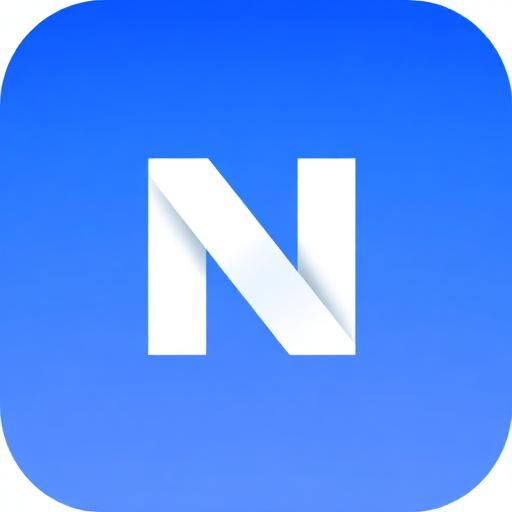

<p align="center">
  
</p>

<h1 align="center">Nextup Resources</h1>

<p align="center">
  <strong>Quality Education for Everyone</strong>
</p>

<p align="center">
  A curated collection of free courses and resources to help you learn new skills and grow your career.
</p>

<p align="center">
  
  
  
  
  
</p>

---

## ✨ Features

- 📚 **Curated Courses** — Hand-picked courses covering AI, ethical hacking, business, and more
- 📦 **Free Resources** — Downloadable assets, templates, and tools
- ❤️ **Favorites System** — Save courses and resources for quick access
- 🌙 **Dark Mode** — Beautiful light and dark themes
- 📱 **PWA Support** — Install as a native app on any device
- 🎨 **Liquid Glass UI** — Modern iOS/macOS-inspired design
- ⚡ **Blazing Fast** — Built with Vite for instant page loads
- 🔒 **Privacy First** — No tracking, no analytics, your data stays local

---

## 🛠️ Tech Stack

| Category | Technology |
|----------|------------|
| **Framework** | React 18 with TypeScript |
| **Build Tool** | Vite |
| **Styling** | Tailwind CSS + shadcn/ui |
| **Routing** | React Router v6 |
| **State** | TanStack Query |
| **Animations** | CSS Animations + Framer Motion principles |
| **PWA** | vite-plugin-pwa |

---

## 🚀 Getting Started

### Prerequisites

- Node.js 18+ or Bun
- npm, yarn, or bun package manager

### Installation

```bash
# Clone the repository
git clone <your-repo-url>
cd nextup-resources

# Install dependencies
npm install
# or
bun install

# Start development server
npm run dev
# or
bun dev
```

The app will be available at `http://localhost:5173`

### Build for Production

```bash
npm run build
npm run preview
```

---

## 📁 Project Structure

```
src/
├── assets/           # Images and static assets
│   ├── courses/      # Course thumbnail images
│   └── resources/    # Resource thumbnail images
├── components/       # Reusable UI components
│   ├── ui/           # shadcn/ui components
│   ├── Header.tsx    # Navigation header
│   ├── Hero.tsx      # Landing page hero section
│   ├── CourseCard.tsx
│   ├── ResourceCard.tsx
│   └── ...
├── hooks/            # Custom React hooks
│   ├── useFavorites.ts
│   └── use-mobile.tsx
├── lib/              # Utility functions
├── pages/            # Route pages
│   ├── Index.tsx     # Home page
│   ├── Courses.tsx   # Courses listing
│   ├── Resources.tsx # Resources listing
│   ├── Favorites.tsx # Saved items
│   ├── Contact.tsx   # Contact form
│   └── Install.tsx   # PWA installation guide
├── App.tsx           # Root component with routing
├── main.tsx          # Application entry point
└── index.css         # Global styles and design tokens
```

---

## 📱 PWA Installation

### iOS (Safari)
1. Open the website in Safari
2. Tap the Share button
3. Select "Add to Home Screen"

### Android (Chrome)
1. Open the website in Chrome
2. Tap the menu (⋮)
3. Select "Add to Home Screen" or "Install App"

### Desktop (Chrome/Edge)
1. Look for the install icon in the address bar
2. Click "Install"

---

## 🎨 Design System

The app uses a custom "Liquid Glass" design system inspired by iOS and macOS:

- **Glass morphism** — Translucent surfaces with backdrop blur
- **Spring animations** — Physics-based motion that feels natural
- **Semantic colors** — All colors defined as CSS custom properties
- **Dark mode** — Automatic theme switching with smooth transitions

### Color Tokens

```css
--background    /* Page background */
--foreground    /* Primary text */
--primary       /* Brand color */
--secondary     /* Secondary surfaces */
--muted         /* Subdued elements */
--accent        /* Highlights */
--destructive   /* Error states */
```

---

## 🔐 Privacy

This application:
- ✅ Stores favorites locally in your browser
- ✅ Uses session storage for UI state only
- ❌ Does NOT track users
- ❌ Does NOT use analytics
- ❌ Does NOT collect personal data

---

## 📄 License

This project is for educational purposes.

---

<p align="center">
  Made with ❤️ for learners everywhere
</p>
