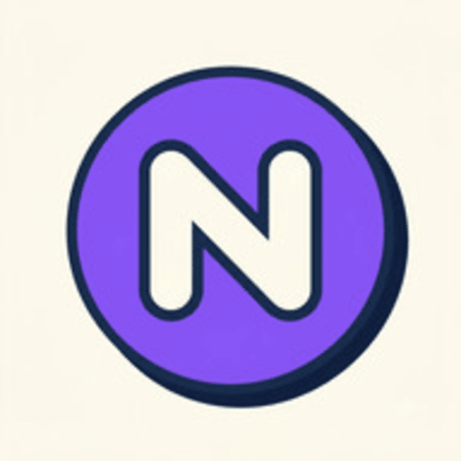

<p align="center">
  
</p>

<h1 align="center">Nextup Resources</h1>

<p align="center">Premium courses, free resources, ebooks, apps, and AI tools — all in one place.</p>

<p align="center">
  <a href="https://nextup-resource.vercel.app">
    
  </a>
  <a href="https://www.instagram.com/hereyourchampion/">
    
  </a>
  <a href="https://www.youtube.com/@nextupstudioyt">
    
  </a>
</p>

---

## Overview

Nextup Resources is a curated learning platform that aggregates high-quality educational content across multiple categories. Built with a bold **Playful Geometric** design system inspired by Memphis Group aesthetics, it delivers a premium, human-crafted experience on every device.

## Features

- **50+ Premium Courses** — AI, web development, trading, cybersecurity, and more
- **Free Resources** — Downloadable packs, templates, and creative assets
- **Ebooks Library** — Curated ebooks for self-improvement and professional growth
- **Apps & Websites** — Handpicked productivity tools and entertainment apps
- **AI Tools Directory** — Discover and explore 50+ AI-powered tools
- **FOSS Apps** — 700+ free & open-source Android apps from the community catalog
- **Shizuku Apps** — Power apps that work without root via Shizuku
- **Morphe Builds** — Live-fetched patched Android builds from `nullcpy/rvb` GitHub releases (12h SWR cache)
- **Material You Apps** — 1100+ apps designed for Material You, sourced from `nyas1/Material-You-app-list`
- **Telegram Tweaks** — 20+ hand-picked Telegram bots grouped by category (Downloaders, File Tools, Music, AI & Assistants, Bot Dev & Community, Trading) with an on-page search bar
- **Placement Material** — Curated company-prep bundles
- **Global Search** — Fuzzy, multi-field search across every category (titles, categories, tags, descriptions) from the home page, with rich result cards
- **Resourcely Chatbot** — In-app assistant powered by Lovable AI with DeepSeek fallback; keys managed from `/admin`
- **What's New Inbox** — Bell icon surfacing every item (including Telegram bots) added in the last 30 days
- **Welcome Intro** — One-time onboarding modal with “Don't show again”, reopenable from the footer
- **Triple Bottom Nav** — Cycles between Primary → More → Misc menus on mobile
- **Favorites System** — Bookmark content across all categories with persistent storage
- **Study Mode** — Focus-oriented UI with a calming green palette
- **Dark Mode** — Full light/dark theme support with refined contrast
- **PWA Support** — Install as a native app on any device for offline access.
- **Responsive Design** — Mobile-first with adaptive bottom navigation

## Tech Stack

<p align="left">
  
  
  
  
  
  
  
  
</p>

| Layer       | Technology                          |
| ----------- | ------------------------------------ |
| Framework   | React 18 + TypeScript 5             |
| Build Tool  | Vite 5                              |
| Styling     | Tailwind CSS 3 + shadcn/ui          |
| Routing     | React Router 6                      |
| State       | TanStack React Query + Custom Hooks |
| Fonts       | Outfit + Plus Jakarta Sans          |
| Design      | Playful Geometric (Memphis-inspired)|
| PWA         | vite-plugin-pwa                     |

## Getting Started

```bash
# Clone the repository
git clone <repo-url>
cd nextup-resources

# Install dependencies
npm install

# Start development server
npm run dev

# Build for production
npm run build
```

## Project Structure

```
src/
├── components/     # Reusable UI components
├── data/           # Static content data (courses, resources, etc.)
├── hooks/          # Custom React hooks
├── lib/            # Utilities and helpers
├── pages/          # Route-level page components
└── assets/         # Static images and icons
```

## Design System

The app uses a **Playful Geometric** design language featuring:
- Warm cream backgrounds with high-contrast slate text
- Chunky 2px borders with hard offset shadows (no blur)
- Bouncy `cubic-bezier(0.34, 1.56, 0.64, 1)` animations
- Vibrant accent palette: Violet, Pink, Amber, Emerald
- Outfit headings + Plus Jakarta Sans body typography

## License

© 2026 Nextup Resources. All rights reserved.
