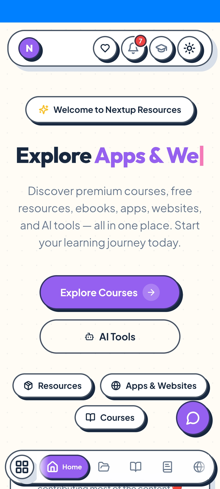
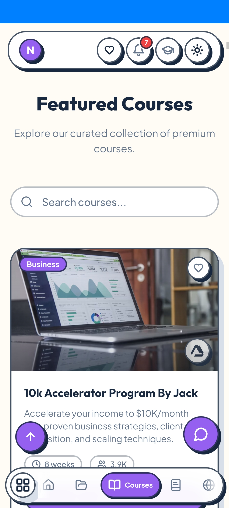
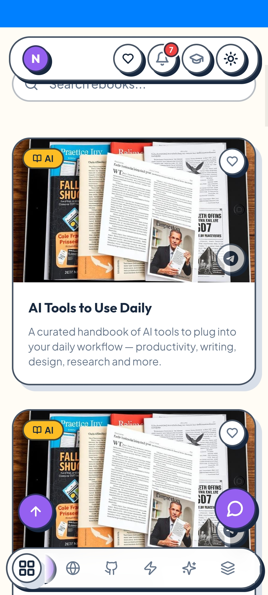
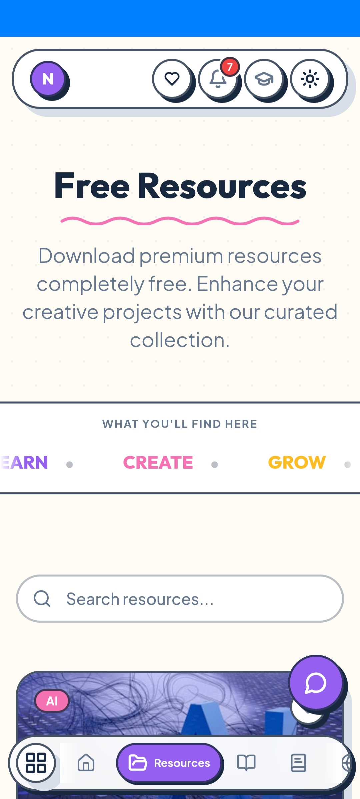
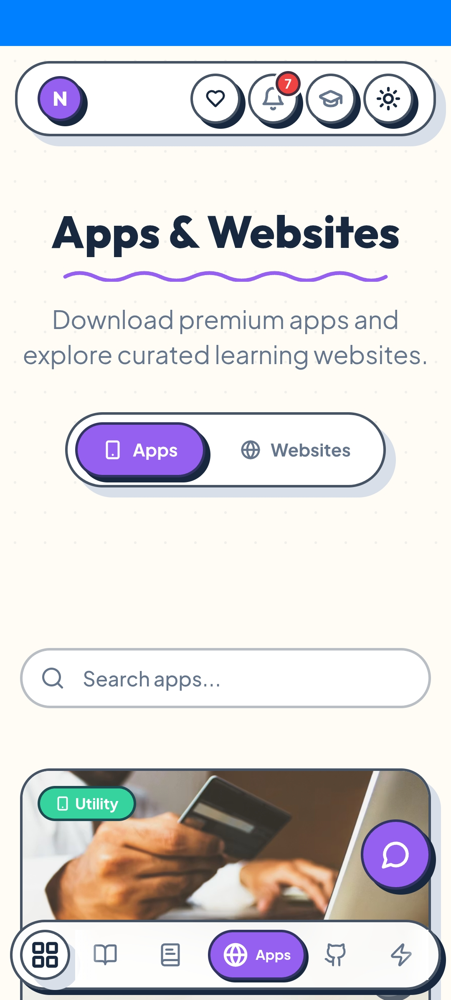

<p align="center">
  
</p>

<h1 align="center">Nextup Resources</h1>

<p align="center">Premium courses, free resources, ebooks, apps, and AI tools — all in one place.</p>

<p align="center">
  <a href="https://nextup-resource.vercel.app">
    
  </a>
  <a href="https://github.com/shreyagarwal72/nextup-resource/releases/latest">
    
  </a>
  <a href="https://www.instagram.com/hereyourchampion/">
    
  </a>
  <a href="https://www.youtube.com/@nextupstudioyt">
    
  </a>
</p>

---

## Overview

Nextup Resources is a curated learning platform offering premium courses, AI tools, ebooks, apps, FOSS collections, and productivity resources through a modern, mobile-first experience.

## Features

- 50+ Premium Courses
- Free Resources
- Ebooks Library
- AI Tools Directory
- FOSS Apps
- Shizuku Apps
- Morphe Builds
- Material You Apps
- Telegram Tweaks
- Placement Material
- Operating Systems Catalog
- Android TV Apps
- Global Search
- Resourcely Chatbot
- What's New Inbox
- Favorites
- Study Mode
- Dark Mode
- Settings
- Deep Linking
- PWA Support
- Smart Offline Support
- Responsive Design

## 📸 Screenshots

<p align="center">
  
  
  
  
  
</p>

## Tech Stack

- React 18
- TypeScript 5
- Vite
- Tailwind CSS
- shadcn/ui
- React Router
- TanStack Query
- PWA

## Getting Started

```bash
git clone https://github.com/shreyagarwal72/nextup-resource.git
cd nextup-resource
npm install
npm run dev
```

## License

© 2026 Nextup Resources. All rights reserved.

## ⭐ Support

If you enjoy this project, consider giving it a ⭐ on GitHub.

Made with ❤️ by Nextup Studio.
